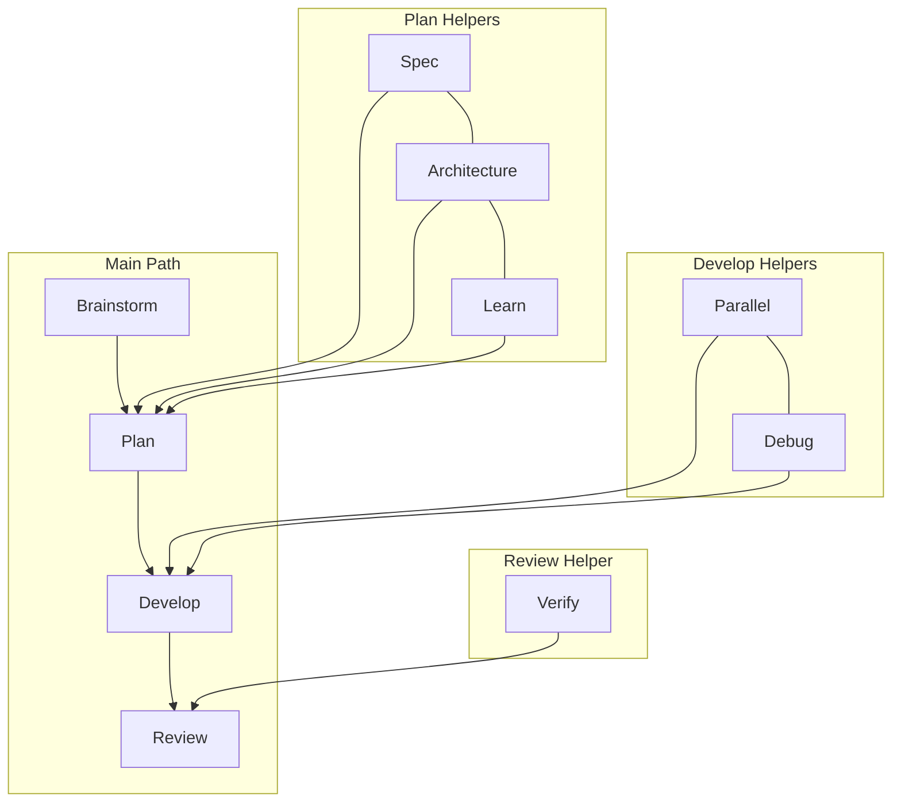

# oh-my-cursor

> [!WARNING]
> This project is still in active testing. Behavior, defaults, and workflow details may evolve.

> Turn Cursor into a disciplined engineering teammate.

`oh-my-cursor` is a Cursor plugin for teams that want AI help to feel more like a strong senior engineer:
clearer planning, tighter implementation, better review quality, safer handoffs, and less prompt chaos.

It stays Cursor-native.
No custom runtime.
No fake command layer.
No giant system prompt.

## Why It Stands Out

- **Skill-first execution**: reusable workflows instead of one-off prompt rituals
- **Real engineering discipline**: plan, develop, verify, review, debug, and learn as distinct modes
- **Specialist subagents**: planning, research, implementation, review, and docs roles that reinforce each workflow
- **Pack-aware guidance**: frontend, Java backend, iOS, Android, Flutter, and React Native support
- **Guardrails without drama**: routing, persistence, and safety hooks that keep work on track
- **Actually testable**: routing evals, output-contract checks, skill validation, and plugin verification

## Before / After

Instead of this:

```text
"please be careful, think deeply, review everything, don't miss edge cases,
follow our style, test it, and also maybe plan first..."
```

You get this:

```text
idea -> spec -> plan -> develop -> review
```

With explicit skills, domain context, and verification built in.

## Core Idea

`oh-my-cursor` combines four small surfaces that reinforce each other:

- `rules/` for durable engineering expectations
- `skills/` for reusable workflows
- `agents/` for narrow specialist lanes
- `hooks/` for routing, persistence, and safety

That combination makes Cursor feel less like “a chat box with code access” and more like “a programmable engineering operating model”.

## Workflow Catalog

The workflow names are intentionally developer-native:

- `omc-brainstorm`
- `omc-spec`
- `omc-plan`
- `omc-develop`
- `omc-verify`
- `omc-review`
- `omc-architecture`
- `omc-parallel`
- `omc-debug`
- `omc-learn`

They are designed to read naturally in both explicit invocation and natural language.

## Workflow Map



Default path:

```text
brainstorm -> plan -> develop -> review
```

Helpers come in only when the task really needs them.

## Domain Packs

`oh-my-cursor` is not a generic “works on everything equally” prompt pack.
It is opinionated about real app-team surfaces:

- `omc-frontend`
- `omc-java-backend`
- `omc-ios`
- `omc-android`
- `omc-flutter`
- `omc-react-native`

Each pack brings:

- stack-aware rules
- specialist agents
- repo heuristics
- better verification prompts

## Specialist Subagents

Subagents are not the main user surface.
They are the internal specialist system that strengthens each workflow.

- **Planning**: `pm-planner`, `question-asker`
- **Research**: `repo-researcher`, `debug-investigator`
- **Implementation**: `frontend-engineer`, `java-backend-engineer`, `ios-engineer`, `android-engineer`, `flutter-engineer`, `react-native-engineer`
- **Review**: `frontend-qa-reviewer`, `backend-qa-reviewer`, `mobile-qa-reviewer`, `architecture-reviewer`, `migration-reviewer`, `test-writer`
- **Documentation**: `docs-maintainer`

The design principle is simple:

```text
workflow = user-facing mode
subagent = internal specialist role
```

Users choose workflows.
The system brings in the right specialist context behind the scenes.

## Workflow -> Subagents

```mermaid
flowchart TB
    subgraph MainWorkflows["Main Workflows"]
        direction LR
        B["Brainstorm"]
        P["Plan"]
        D["Develop"]
        R["Review"]
    end

    subgraph HelperWorkflows["Helper Workflows"]
        direction LR
        S["Spec"]
        V["Verify"]
        A["Architecture"]
        X["Debug"]
        L["Learn"]
        M["Parallel"]
    end

    subgraph SpecialistRoles["Specialist Subagents"]
        direction LR
        P1["pm-planner"]
        Q1["question-asker"]
        R1["repo-researcher"]
        T1["test-writer"]
        AR["architecture-reviewer"]
        DR["debug-investigator"]
        DM["docs-maintainer"]
        FE["implementation engineers"]
        QA["QA reviewers"]
    end

    B --> P1
    P --> P1
    P --> Q1
    P --> R1
    P --> AR
    D --> R1
    D --> T1
    D --> DM
    D --> FE
    R --> QA
    R --> AR
    R --> T1
    V --> T1
    V --> R1
    A --> AR
    A --> R1
    X --> DR
    X --> R1
    X --> T1
    L --> DR
    L --> DM
    L --> T1
    M --> P1
    M --> R1
    M --> AR
    M --> FE
    M --> QA
    M --> T1
```



## Why This Works

### 1. It separates modes most AI setups blur together

Planning is not implementation.
Review is not debugging.
Architecture is not a vague “think harder” instruction.

That separation is the difference between AI that feels impressive in demos and AI that can actually support a team for weeks.

### 2. It uses progressive disclosure instead of stuffing everything into one file

Skills stay light.
Companion references hold deeper guidance.

That keeps routing sharp while still letting complex work pull in more detail when needed.

### 3. It is built to survive drift

This repo includes automated checks for:

- plugin metadata integrity
- workflow routing behavior
- agent capability and profile consistency
- output-contract consistency
- skill frontmatter, structure, and reference-link validity

This is a plugin you can evolve, not just admire once.

## Repository Structure

| Path | Purpose |
| --- | --- |
| `.cursor-plugin/plugin.json` | Cursor plugin manifest |
| `skills/` | workflow and domain skill entrypoints |
| `agents/` | focused subagent definitions |
| `hooks/` | routing, persistence, and governance hooks |
| `rules/` | durable stack-aware rules |
| `config/` | workflow, pack, capability, and guidance metadata |
| `references/` | companion checklists and support material |
| `docs/` | maintainer-facing architecture and orchestration guidance |
| `scripts/` | build and verification utilities |

## Install

### Requirements

- [Cursor](https://cursor.com) with Skills, Subagents, and Hooks enabled
- Node.js for the bundled hook scripts

### Quick Install

```bash
curl -fsSL https://raw.githubusercontent.com/xiushaomin/oh-my-cursor/main/install.sh | bash
```

### Update

```bash
curl -fsSL https://raw.githubusercontent.com/xiushaomin/oh-my-cursor/main/update.sh | bash
```

The update script treats the remote branch as the source of truth and resets the installed checkout to `origin/main`.

### Uninstall

```bash
curl -fsSL https://raw.githubusercontent.com/xiushaomin/oh-my-cursor/main/uninstall.sh | bash
```

### Manual Install

```bash
git clone https://github.com/xiushaomin/oh-my-cursor.git
cd oh-my-cursor
mkdir -p ~/.cursor/plugins/local/oh-my-cursor
rsync -a --delete --exclude '.git' ./ ~/.cursor/plugins/local/oh-my-cursor/
```

Restart Cursor, or run `Developer: Reload Window`.

## Quality Gates

After editing workflow, pack, capability, or subagent metadata, run:

```bash
node scripts/build-guidance-index.mjs
node scripts/verify-guidance-index.mjs
node scripts/verify-plugin.mjs
node scripts/verify-skill-evals.mjs
node scripts/verify-agents.mjs
node scripts/verify-output-contracts.mjs
node scripts/verify-skills.mjs
node --test tests/*.test.mjs
```

## Status

The repo already ships with real validation and a coherent operating model, so it is much closer to a working engineering product than a prompt experiment.

## Learn More

- [ARCHITECTURE.md](ARCHITECTURE.md)
- [docs/orchestration-patterns.md](docs/orchestration-patterns.md)
